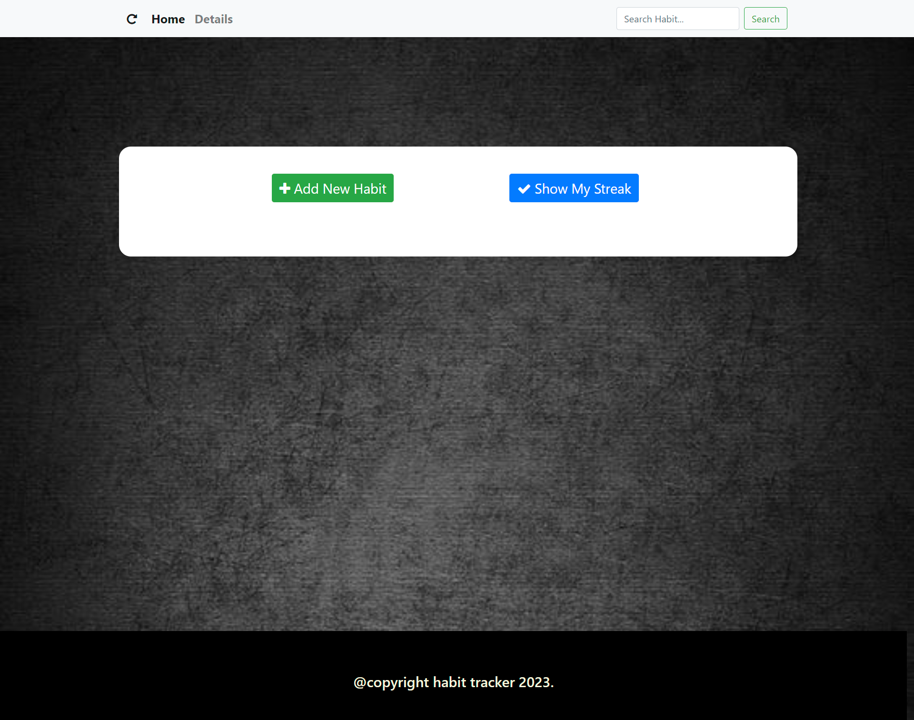
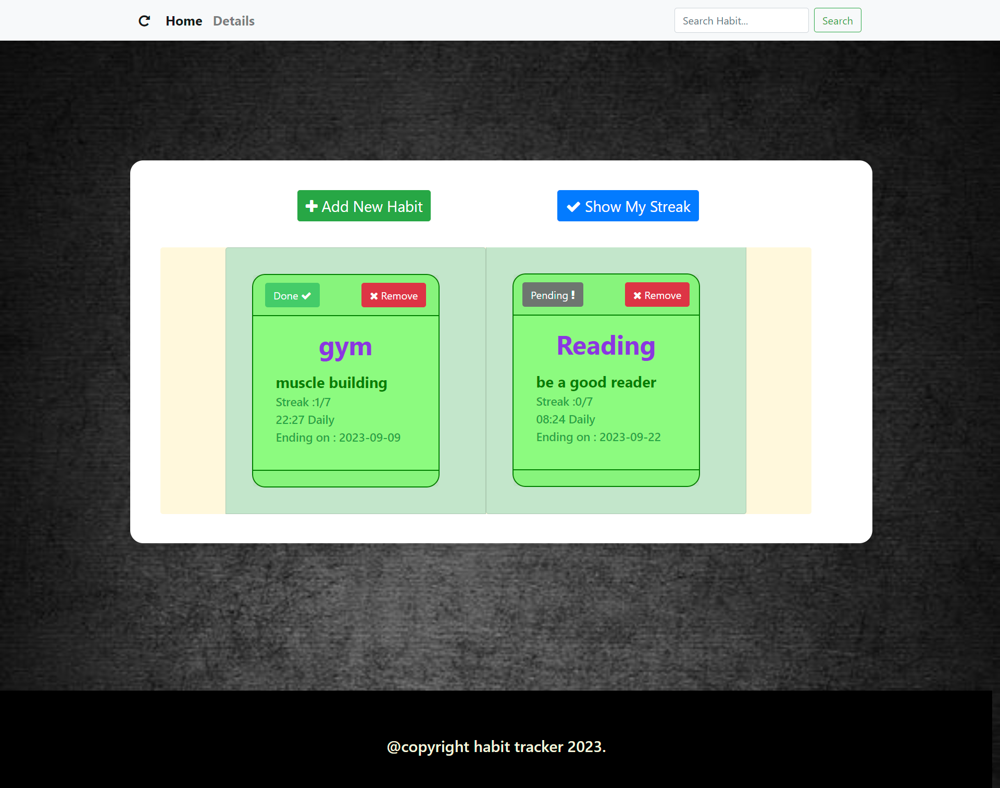
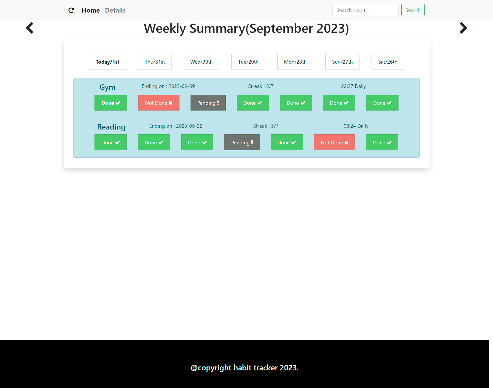

# Placement Cell App

## Introduction

Create a **habit tracker app**, where we can define habits and track them. Create a fullstack app with Nodejs and Ejs
This web application helps students to store following details:

 

-  habits
-	Habits Details (including college, status: [placed, not_placed])

 

## 🔗 Important Links

> ## Checkout the Website [Web Application](https://habit-tracker-app-s44j.onrender.com/)
>
> ## Checkout the Application Demo Video [YouTube](https://www.youtube.com/watch?v=kSEyJI1n5dw)

 

## Features

- **Add New Habit**

 User can able to create new habit by entering details such as - habit name, what you want to Achieve, End Date(Optional), Time, Frequency.

- **Remove Habit**

 User can able to delete the existing habit.

- **Update status of Habit**

 user can able to update status of the habit as  Done, Not Done, Pending.

- **Show Weekly Summary**

 User can able to check the status of the weekly streak and can also able to update the task as Done, Not Done, Pending.  

## Getting Started With Project
- Fork the Project in your Repository.
- Clone the Forked Repository in your Local System.
- Install & Configure - NodeJS, MongoDB, Robo3T, POSTMAN.
- Create '.env' file & Set the Environment Variables in it, as per the 'ENV_FORMAT.json' file.
- Run 'npm install' in GitBash Terminal
- If you want to run the project in development mode locally then go to '.env' file & set,
  ENVIRONMENT=development
  DEPLOYMENT=local
- For Development Mode:
  Run 'npm run dev_start' in GitBash Terminal
## Library Used
- connect-flash
- connect-mongo
- dotenv
- ejs
- express
- express-ejs-layouts
- express-session
- mongoose
- nodemon

- Framework: ExpressJS, Bootstrap
- Database: MongoDB
- Version Control System: Git
- VCS Hosting: GitHub
- Programming / Scripting: Vanilla JavaScript
- Front-End: SCSS, EJS
- Runtime Environment: NodeJS
- Integrated Development Environment: VSCode

## Screens

## Home Page 

### Add New Habit

### Display Added Habit

### Show Weekly Streak

